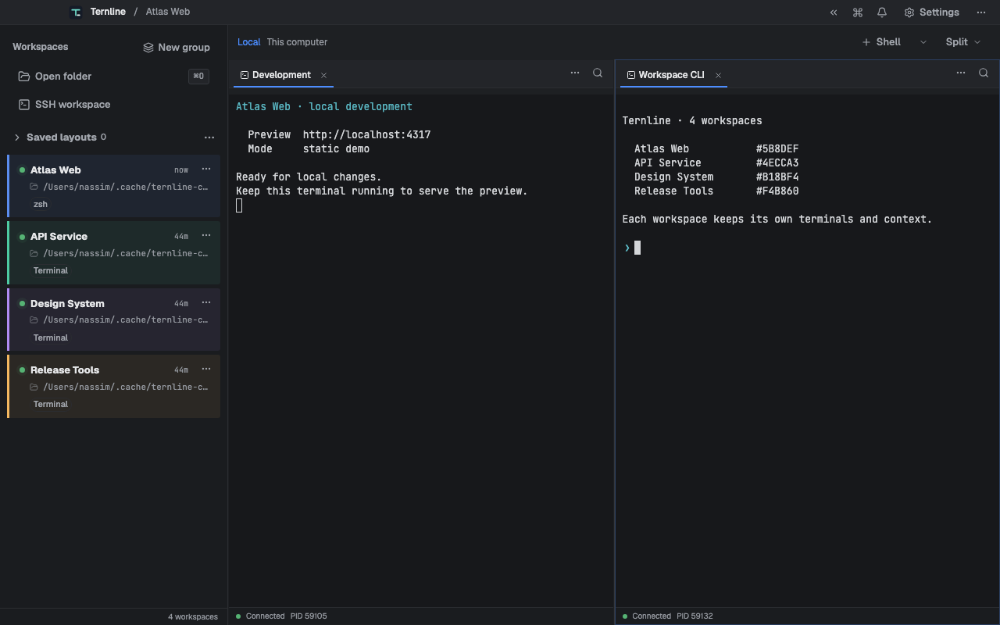

# Ternline

> The internal `agent-workspace` slug remains stable for user data and automation integrations.

Ternline is a desktop workspace for local and SSH terminals, browser previews, and CLI automation.
Linux, macOS, and Windows. Free and open source; currently in alpha.

[Download Ternline](https://ternline.com/#downloads) · [Installation instructions](docs/INSTALLATION.md) · [GitHub Releases](https://github.com/nassimna/ternline/releases)



| Platform     | Choose                                                                                             |
| ------------ | -------------------------------------------------------------------------------------------------- |
| Linux x86_64 | AppImage, Debian/Ubuntu DEB, Fedora/RHEL RPM; [Arch package instructions](packaging/aur/README.md) |
| macOS        | Apple Silicon or Intel DMG; approve the unsigned app on first launch                               |
| Windows x64  | Per-user EXE installer; Windows may show a publisher warning                                       |

The Linux package bundles Node. OpenSSH is required at startup; AppImage users may need FUSE 2.
See [installation and verification](docs/INSTALLATION.md) for dependencies, checksums, download
signatures, updates, and profile-preserving removal. Linux and Windows ARM64 packages are unavailable.

Ternline is an independent, clean-room implementation and does not copy another product's source,
assets, identity, or trademarks. The desktop, server, CLI, and shared contracts are TypeScript.

This is alpha software. Milestones 0–5 are established on the documented Linux reference host.
Milestone 6 release-candidate work is implemented in substantial part but remains in validation;
prereleases are distributed through [GitHub Releases](https://github.com/nassimna/ternline/releases) and the [website](https://ternline.com). There is no stable release or public support guarantee; macOS and Windows installers lack platform code signing.

## What works

- Backend-authoritative workspaces, recursive split panes, tabs, real PTYs, durable SQLite state,
  configuration, notifications/attention, recovery, renderer reload reconstruction, and sidebar
  metadata for working directory, Git branch, selected process, and listening ports.
- Sandboxed Electron UI with xterm.js terminals and isolated native browser views that receive no
  Node, preload, or desktop-bridge privileges.
- Visible workspace pins and saved SSH workspaces that launch OpenSSH with an existing alias, key,
  or host configuration.
- Searchable command palette, editable shortcuts, keyboard navigation, appearance/terminal/
  notification settings, and alpha update controls.
- Authenticated local protocol and packaged JSON CLI for workspace list/create, terminal
  create/send, pane split, identify, notifications, and reversible agent hooks.
- Native Linux x64 AppImage/deb/rpm, macOS Intel and Apple Silicon DMG/zip, and Windows x64 NSIS
  packaging with deterministic `SHA256SUMS` and GitHub update metadata. Update installation
  requires explicit user approval.
- Linux package, security, SBOM, provenance, and clean-container workflow definitions. The
  release-candidate workflow retains direct accessibility and visual validation; Node performance
  qualification and manual gates remain open.

Download signatures are available for releases with Minisign `.sig` files; they do not provide
Apple or Microsoft publisher trust. Native hosted runners check packaged startup and the CLI/PTY
journey; that does not qualify every physical device, OS version, installer trust prompt, or in-app
update installation. The eight-hour Node soak and human assistive-technology checks remain open.
Read [Known limitations](docs/KNOWN_LIMITATIONS.md) before evaluating support. The 2026-07-18 local
soak attempt was intentionally stopped after about 3 hours 8 minutes and produced no report; it is
explicitly deferred, not passed.

## User documentation

- [Supported features and boundaries](docs/FEATURES.md)
- [Node Linux AppImage and CLI installation](docs/node-linux-packaging.md)
- [Installation and uninstall](docs/INSTALLATION.md)
- [Configuration](docs/CONFIGURATION.md)
- [SSH workspaces](docs/SSH_WORKSPACES.md)
- [Keyboard shortcuts](docs/SHORTCUTS.md)
- [CLI reference](docs/CLI.md)
- [Agent integrations](docs/AGENT_INTEGRATIONS.md)
- [Accessibility evidence](docs/ACCESSIBILITY.md)
- [Desktop updates](docs/UPDATES.md)

## Engineering documentation

- [Architecture](docs/ARCHITECTURE.md) and [protocol](docs/PROTOCOL.md)
- [Security model](docs/SECURITY_MODEL.md) and [security policy](SECURITY.md)
- [Performance qualification](docs/PERFORMANCE.md)
- [Release process](docs/RELEASING.md) and [qualification record](docs/RELEASE_QUALIFICATION.md)
- [Implementation specification](docs/IMPLEMENTATION_SPEC.md),
  [milestone completion audit](docs/IMPLEMENTATION_MILESTONE_AUDIT.md), and [roadmap](ROADMAP.md)
- [Contributing](CONTRIBUTING.md) and [dependency record](docs/DEPENDENCIES.md)
- [Desktop design system](docs/DESIGN_SYSTEM.md)

## Local development

Requires Node.js 22.23.3, pnpm 10.34.5, a native-addon build toolchain, and Electron's Linux development libraries.

```sh
corepack enable
pnpm install
pnpm dev
```

Run the repository gate with `pnpm validate`. Focused commands and packaging/qualification steps
are documented in [CONTRIBUTING.md](CONTRIBUTING.md). Test totals change as coverage grows, so the
status does not use a stale count as a quality claim.

Historical Rust-package performance evidence passed its smoke gates: aggregate PSS was
307.20 MiB for one terminal (limit 350 MiB) and 331.72 MiB for ten terminals (limit 700 MiB), while
the packaged process tree averaged 0.8893% CPU during a five-minute idle window after a five-minute
settle (strict limit below 1%). Cold/warm launch and resize passed their informational targets. This does not qualify the Node package or the unrun eight-hour soak; see
[Performance](docs/PERFORMANCE.md).

## Browser automation for agents

The authenticated local CLI controls an isolated browser session or attaches to an existing browser
tab without a confirmation prompt. Every operation uses `--session-id`; `browser open` without one
creates an isolated session and returns its ID. For example:

```sh
ternline-cli browser open --url http://localhost:3000
ternline-cli browser attach --tab-id UUID
ternline-cli browser snapshot --session-id UUID
ternline-cli browser type --session-id UUID --role textbox --name Email --text user@example.com --clear
ternline-cli browser click --session-id UUID --role button --name Submit
ternline-cli browser press --session-id UUID --key a --modifiers control
ternline-cli browser wait --session-id UUID --text Saved --timeout-ms 10000
ternline-cli browser screenshot --session-id UUID --output result.png
```

Use `--selector CSS` or `--text-target TEXT` instead of role/name locators. `browser query`
returns matching element text, values and attributes. `browser eval --expression JAVASCRIPT`
returns a JSON value. `browser scroll --delta-y 600 [--selector CSS]`, `browser resize
--width 1280 --height 720`, and `browser appearance --theme light|dark|system` control the view.
All these commands also require `--session-id UUID`.

Start diagnostics before navigating to include initial page traffic:

```sh
ternline-cli browser network start --session-id UUID
ternline-cli browser open --session-id UUID --url http://localhost:3000
ternline-cli browser network list --session-id UUID
ternline-cli browser network get --session-id UUID --request-id ID
ternline-cli browser network body --session-id UUID --request-id ID
ternline-cli browser console --session-id UUID --follow --level error
ternline-cli browser errors --session-id UUID --after 0
ternline-cli browser recording start --session-id UUID --width 1280 --height 720
ternline-cli browser recording stop --session-id UUID --output flow.webm
ternline-cli browser network stop --session-id UUID
```

Diagnostic output includes cursors for reading new events. `--follow` emits newline-delimited
JSON and stops normally on Ctrl+C; `--clear` reads and clears the current buffer. Buffers and
response bodies have bounded retention, so inspect the returned truncation/drop indicators.
Screenshot and recording downloads verify artifact length and SHA-256, release the transfer
handle, and return the absolute saved path. Network capture is session scoped; opening user
DevTools interrupts instrumentation; create a new automation session after closing DevTools.
Recordings capture browser content without audio, stop automatically after two minutes,
and have a 16 MiB limit.

## License

GPL-3.0-or-later. See [LICENSE](LICENSE) and [NOTICE](NOTICE).
